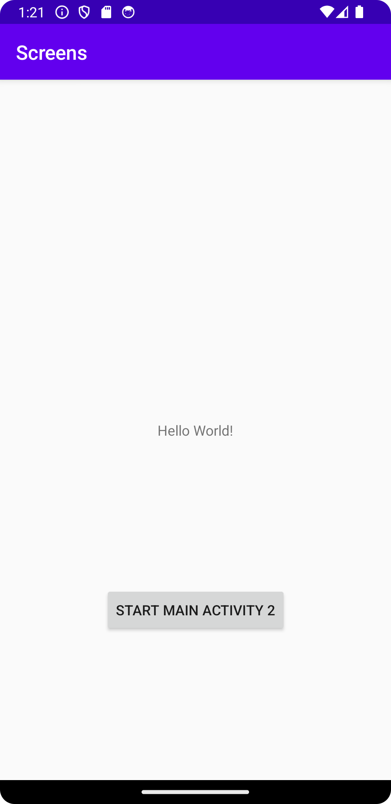
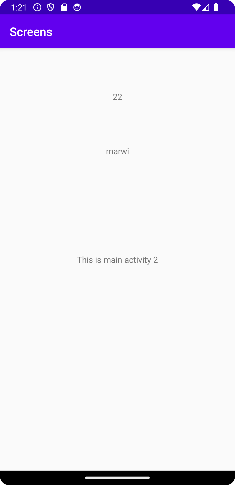

Rapport.

Enligt uppgits-beskrivningen är första steget i denna uppgift att skapa en tlll activity.
File -> new -> activity -> empty activity.
Efter detta skapade jag en knapp i main activity som ska kopplas till activity två. Jag lade till en listener som implementerades i onCreate classen som ligger i main activity. 
Kopplingen mellan main activity 2 och button implementerades och intent data till main activity 2 lades till.
Koden nedan visar hur delar av uppgiften har lösts i MainActivity och MainActivity 2.

MainActivity.
```
        Button b = findViewById(R.id.button);
        b.setOnClickListener(new View.OnClickListener() {
            @Override
            public void onClick(View view ) {
                Intent intent = new Intent (MainActivity.this, MainActivity2.class);
                intent.putExtra("name","marwi");
                intent.putExtra("number", 22);
                startActivity(intent);
                Log.d("==>","we clicked on button");
```

MainActivity2.
```
 name = findViewById(R.id.set_name);
        number = findViewById(R.id.set_number);

        Bundle extras = getIntent().getExtras();
        if(extras != null){
            String name = extras.getString("name");
            int number = extras.getInt("number");

    }
        name.setText(extras.getString("name"));
        number.setText(String.valueOf(extras.getInt("number")));
```
Bilder läggs i samma mapp som markdown-filen.


